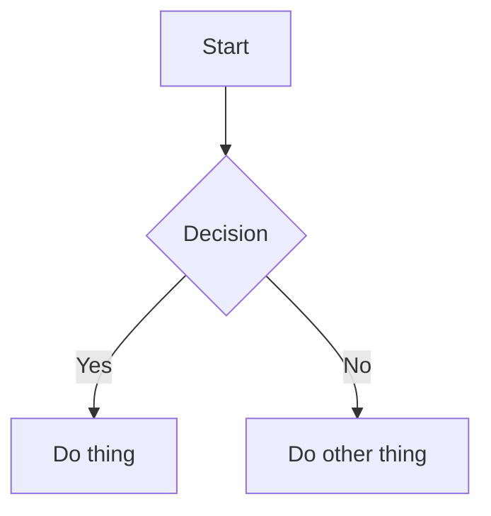

# Write Markdown & Mermaid (Raw)

## Markdown basics
- Headings: `#`, `##`, `###`
- Lists: `- item` or `1. item`
- Code: backticks for inline and fenced blocks for multi-line

## Mermaid (raw)
Use a fenced code block with `mermaid`:

## Tips
- Keep diagrams small and focused.
- Use clear labels and consistent casing.
