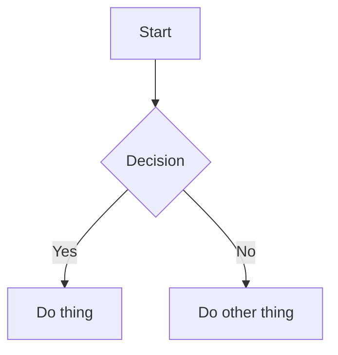
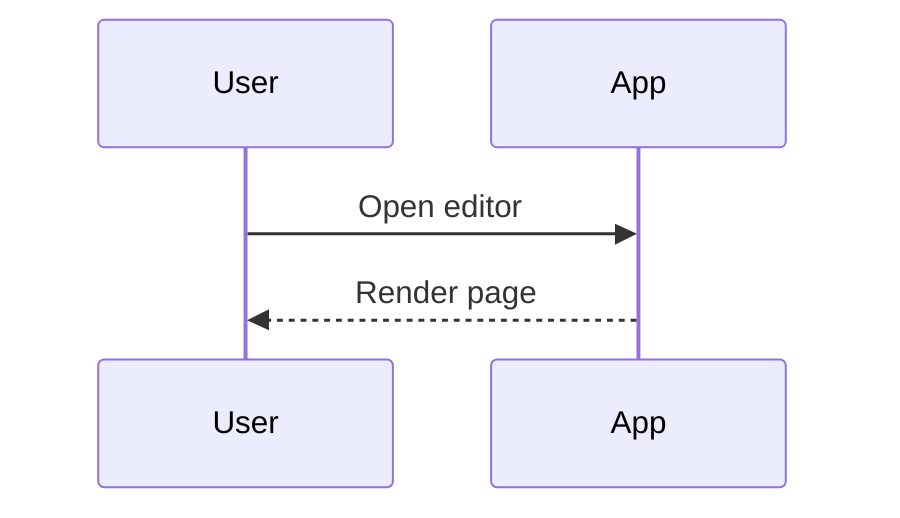
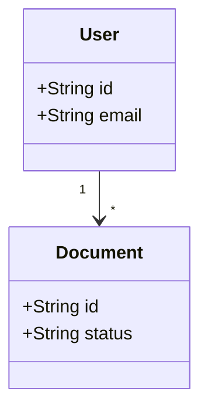
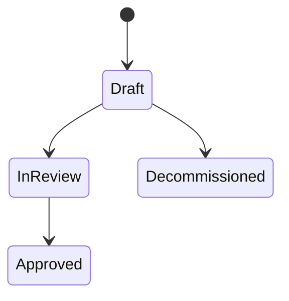
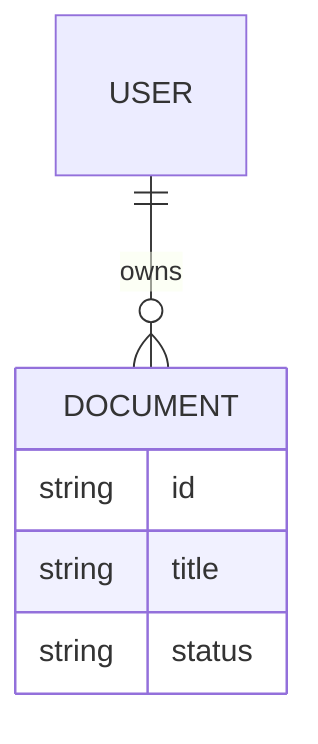
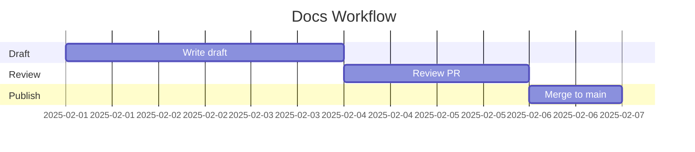

# Write Markdown & Mermaid (Raw)

This guide shows how to write clean Markdown and Mermaid directly in your docs.

## Markdown basics

### Headings
```md
# Page Title
## Section
### Subsection
```

### Lists
```md
- Bullet item
- Another item

1. Step one
2. Step two
```

### Emphasis
```md
**Bold**, *Italic*, and `inline code`
```

### Links
```md
[OpenAI](https://openai.com)
```

### Images
```md

```

### Code blocks
```md
```ts
const status = "draft";
```
```

## Mermaid (raw)

Use a fenced code block with `mermaid`:



### Sequence diagram example


### Flowchart tips
- Keep nodes short and readable
- Use consistent casing in labels
- Avoid deep nesting in one diagram

## Common mistakes
- Missing closing fences (```)
- Using unsupported Mermaid syntax
- Mixing tabs and spaces in code blocks

## Recommended structure
- Title
- Short summary
- Sections with examples
- Notes or caveats

## Mermaid examples

### Flowchart


### Sequence diagram


### Class diagram


### State diagram


### ER diagram


### Gantt

